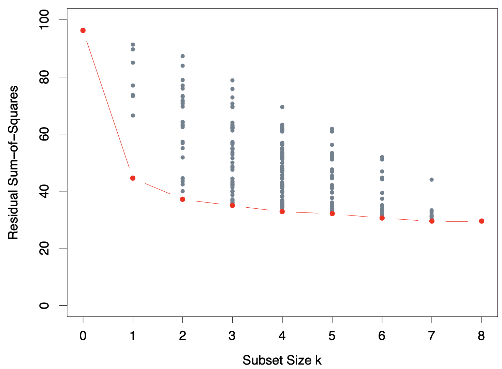
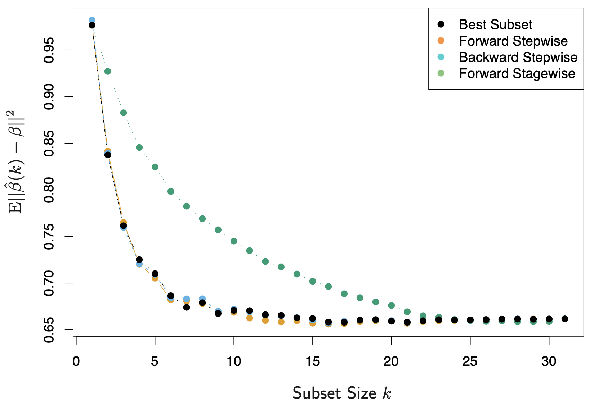

3.3 Subset Selection
=====================================

There are two reasons why we are often not satisfied with the least squares estimates:

* **Prediction accuracy:** The least squares estimates often have low bias but large variance. Prediction accuracy can sometimes be improved by shrinking or setting some coefficients to zero. By doing so we sacrifice a little bit of bias to reduce the variance of the predicted values.
* **Interpretation:** With a large number of predictors, we often would like to determine a smaller subset that exhibit the strongest effects. In order to get the "big picture", we would like to sacrifice some small details.

**Model selection** includes variable subset selection, shrinkage and hybrid approaches. In this section, we discuss a number of approaches to variable subset selection with linear regression.

3.3.1 Best-Subset Selection
-------------------------------------

Best subset regression finds for each :math:`k \in \{0, 1, \dots, p\}` the subset of size :math:`k` that gives smallest residual sum of squares. An efficient algorithm -- the *leaps and bounds* procedure -- makes this feasible for :math:`p` as large as 30 or 40.

The figure below shows all the subset models for the prostate cancer example. The question of how to choose :math:`k` involves the tradeoff between bias and variance, along with the more subjective desire for parsimony. Typically we choose the smallest model that minimizes an estimate of the expected prediction error.

3.3.2 Forward- and Backward-Stepwise Selection
-------------------------------------

Rather than search through all possible subsets, we can seek a good path through them. *Forward-stepwise selection* starts with the intercept, and then sequentially adds into the model the predictor that most improves the fit. Clever updating algorithms can exploit the QR decomposition for the current fit to rapidly establish the next candidate (Exercise 3.9).

Forward-stepwise selection is a *greedy algorithm*, producing a nested sequence of models. It might seem sub-optimal but there are several reasons why it might be preferred:

* **Computational:** For large :math:`p` we cannot compute the best subset sequence, but we can always compute the forward stepwise sequence.
* **Statistical:** Forward stepwise is a more constrained search, and will lower variance, but perhaps more bias.

Backward-stepwise selection starts with the full model, and sequentially deletes the predictor that has the least impact on the fit. The candidate for dropping is the variable with the smallest Z-score (Exercise 3.10). Backward selection can only be used when :math:`N > p`, while forward selection can be used even when :math:`p \gg N`.

The figure below shows the results of a small simulation study to compare best-subset regression with forward and backward selection, along with the forward and backward stagewise regression introduced in the next section.

Some software packages implement hybrid stepwise-selection strategies that consider both forward and backward moves at each step, and selection the "best" of the two.

Finally, we note that often variables come in groups, such as the dummy variables that code a multi-level categorical predictor. Smart stepwise procedures will add or drop whole groups at a time, taking proper account of their degrees-of-freedom.

3.3.3 Forward-Stagewise Regression
-------------------------------------

Forward-stagewise regression (FS) is even more constrained than forward stepwise regression. It starts with an intercept equal to :math:`\bar{y}` and centered predictors with coefficients all 0. At each step the algorithm identifies the variable most correlated with the current residual. It then computes the simple linear regression coefficient of the residual on this chosen variable, and then adds it to the current coefficient for that variable. This is continued till none of the variables have correlation with the residuals.

Forward-stagewise regression does not adjust other variables when a term is added to the model, which leads to taking many more than :math:`p` steps to reach the least squares fit. However, it is quite competitive in very high-dimensional problems, as will be shown in Section 3.8.1.

3.3.4 Prostate Cancer Data Example (Continued)
-------------------------------------
