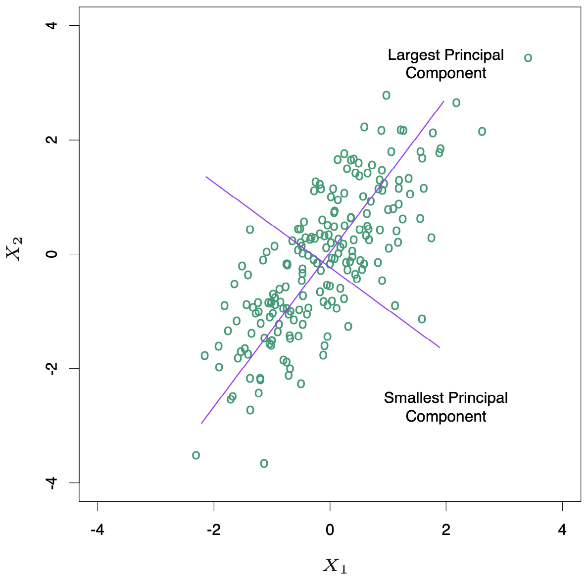

3.4 Shrinkage Methods
=====================================

Subset selection is a discrete process -- variables are either retained or discarded -- it often exhibits high variance, and so doesn't reduce the prediction error of the full model. Shrinkage methods are more continuous, and don't suffer as much from high variability.

3.4.1 Ridge Regression
-------------------------------------

Ridge regression shrinks the regression coefficients by imposing a penalty on their size. The ridge coefficients minimize a penalized residual sum of squares,

.. math::
  :label: eq3-8

  \hat{\beta}^\text{ridge} = \text{argmin}_\beta \left\{ \sum_{i=1}^N\left(y_i - \beta_0 - \sum_{j=1}^p x_{ij}\beta_j\right)^2 + \lambda \sum_{j=1}^p \beta_j^2 \right\}

The larger the value of :math:`\lambda > 0`, the greater the amount of shrinkage. The idea of penalizing by the sum-of-squares of the parameters is also used in neural networks, known as *weight decay* (Chapter 11).

An equivalent way to write the ridge problem is

.. math::

  \hat{\beta}^\text{ridge} = \text{argmin}_\beta \sum_{i=1}^N \left(y_i - \beta_0 - \sum_{i=0}^p x_{ij}\beta_j\right)^2 \;\;\; \text{s.t. } \sum_{j=1}^p \beta_j^2 \leq t

There is a one-to-one correspondence between :math:`\lambda` and :math:`t`. When there are many correlated variables in a linear regression model, their coefficients can become poorly determined and exhibit large variance. With ridge regression this problem can be alleviated.

The ridge solutions are not equivalent under scaling of the inputs, and so one normally standardizes the inputs. It can be shown (Exercise 3.5) that the solution to Equation :eq:`eq3-8` can be separated into two parts, after reparameterization using *centered* inputs: each :math:`x_{ij}` gets replaced by :math:`x_{ij} - \bar{x}`. We estimate :math:`\beta_0` by :math:`\bar{y}`. The remaining coefficients get estimated by a ridge regression without intercept, using the centered :math:`x_{ij}`.

Writing the criterion (Equation \ref{eq:eq3-8}) in matrix form

.. math::

  \text{RSS}(\lambda) = (\mathbf{y} - \mathbf{X}\beta)^\top (\mathbf{y} - \mathbf{X}\beta) + \lambda \beta^\top\beta

The ridge regression solutions are easily seen to be

.. math::

  \hat{\beta}^\text{ridge} = (\mathbf{X}^\top\mathbf{X} + \lambda \mathbf{I})^{-1}\mathbf{X^\top y}

By adding a positive constant to the diagonal of :math:`\mathbf{X}^\top\mathbf{X}` before inversion, the problem is made nonsingular.

Ridge regression can also be derived as the mean or mode of a posterior distribution, with a suitably chosen prior distribution. Suppose :math:`y_i \sim N(\beta_0 + x_i^\top\beta, \sigma^2)`, and the parameters :math:`\beta_j` are each distributed as :math:`N(0, \tau^2)`, independently of one another. Then the (negative) log-posterior density of :math:`\beta`, with :math:`\tau^2` and :math:`\sigma^2` assumed known, is equal to

.. math::

  \sum_{i=1}^N\left(y_i - \beta_0 - \sum_{j=1}^p x_{ij}\beta_j\right)^2 + \lambda \sum_{j=1}^p \beta_j^2

with :math:`\lambda = \sigma^2 / \tau^2` (Exercise 3.6). Thus the ridge estimate is the mode of the posterior distribution; since the distribution is Gaussian, it is also the posterior mean.

.. note::

  **Singular Value Decomposition (SVD)**

  Singular value decomposition decomposes the :math:`N \times p` matrix :math:`\mathbf{X}` as

  .. math::
  
    \mathbf{X} = \mathbf{UDV}^\top \nonumber
  
  where :math:`\mathbf{U}` and :math:`\mathbf{V}` are :math:`N \times p` and :math:`p \times p` orthogonal matrices, with the columns of :math:`\mathbf{U}` spanning the column space of :math:`\mathbf{X}`, and columns of :math:`\mathbf{V}` spanning the row space. :math:`\mathbf{D}` is a :math:`p \times p` diagonal matrix, with diagonal entries :math:`d_1 \geq \dots \geq d_p \geq 0` called the singular values of :math:`\mathbf{X}`. If one or more values :math:`d_j = 0`, :math:`\mathbf{X}` is singular.

The *singluar value decomposition* (SVD) of the centered input matrix :math:`\mathbf{X}` gives us some additional insight into the nature of ridge regression. We can write the least squares fitted vector as

.. math::

  \mathbf{X}\hat{\beta}^\text{ls} & = \mathbf{X}(\mathbf{X^\top X})^{-1}\mathbf{X^\top y} \nonumber \\
	& = \mathbf{UDV}^\top \mathbf{V}^{-\top}\mathbf{D}^{-1}\mathbf{D}^{-\top}\mathbf{V}^{-1} \mathbf{VD^\top U^\top y} \nonumber \\
	& = \mathbf{UU^\top y} \\
	(\mathbf{X}^\top\mathbf{X})^{-1} & = \left((\mathbf{UDV}^\top)^\top \mathbf{UDV}^\top \right)^{-1} \nonumber \\
	& = (\mathbf{VD^\top DV^\top})^{-1} \nonumber \\
	& = \mathbf{V}^{-\top}\mathbf{D}^{-1}\mathbf{D}^{-\top}\mathbf{V}^{-1} \nonumber

Now the ridge solutions are

.. math::

  \mathbf{X}\hat{\beta}^\text{ridge} & = \mathbf{X}(\mathbf{X}^\top\mathbf{X} + \lambda \mathbf{I})^{-1}\mathbf{X^\top y} \nonumber \\
	& = \mathbf{UDV}^\top (\mathbf{VD}^2\mathbf{V}^\top + \lambda \mathbf{VV^\top})^{-1} \mathbf{VD^\top U^\top y} \nonumber \\
	& = \mathbf{UDV}^\top \mathbf{V}^{-\top} (\mathbf{D}^2 + \lambda \mathbf{I})^{-1} \mathbf{V}^{-1} \mathbf{VD^\top U^\top y} \nonumber \\
	& = \mathbf{UD}(\mathbf{D}^2 + \lambda \mathbf{I})^{-1} \mathbf{D}\mathbf{U^\top y} \nonumber \\
	& = \sum_{j=1}^p \mathbf{u}_j \frac{d_j^2}{d_j^2 + \lambda} \mathbf{u}_j^\top \mathbf{y}

where :math:`\mathbf{u}_j` are the columns of :math:`\mathbf{U}`. Like linear regression, ridge regression computes the coordinates of :math:`\mathbf{y}` with respect to the orthogonal basis :math:`\mathbf{U}`. It then shrinks the coordinates by the factors :math:`d_j^2 / (d_j^2 + \lambda)`.

A greater amount of shrinkage is applied to the coordinates of basis vectors with smaller :math:`d_j^2`. The SVD of the centered matrix :math:`\mathbf{X}` is another way of expressing the *principal components* of the variables in :math:`\mathbf{X}`. The sample covariance matrix is given by :math:`\mathbf{S} = \mathbf{X^\top X}/N`. We have

.. math::

  \mathbf{X^\top X} & = \mathbf{VD^\top U^\top UDV^\top} \\
	& = \mathbf{VD}^2\mathbf{V}^\top

which is the *eigne decomposition* of :math:`\mathbf{X}^\top\mathbf{X}`. The eigenvectors :math:`v_j` (columns of :math:`\mathbf{V}`) are also called the *principal components* (or Karhunen-Loeve) directions of :math:`\mathbf{X}`. The first principal component direction :math:`v_1` has the property that :math:`\mathbf{z}_1 = \mathbf{X}v_1` has the largest sample variance amongst all normalized linear combinations of the columns of :math:`\mathbf{X}`. This variance is easily seen to be

.. math::

  \text{Var}(\mathbf{z}_1) = \text{Var}(\mathbf{X}v_1) = \frac{d_1^2}{N}

and in fact :math:`\mathbf{z}_1 = \mathbf{X}v_1 = \mathbf{u}_1d_1`. The derived variable :math:`\mathbf{z}_1` is called the first principal component of :math:`\mathbf{X}` and hence :math:`\mathbf{u}_1` is the normalized first principal component. Conversely the last principal component has *minimum* variance. Hence the small singular values :math:`d_j` correspond to directions in the column space of :math:`\mathbf{X}` having small variance, and ridge regression shrinks these directions the most.

The figure below illustrates the principal components of some data points in two dimensions. The configuration of the data allow us to determine its gradient more accurately in the long direction than the short. Ridge regression protects against the potentially high variance of gradients estimated in the short direction by shrinking the coefficients of low-variance components more than the high-variance components.

The *effective degrees of freedom* of the ridge regression is defined by the quantity

.. math::

  \text{df}(\lambda) & = \text{tr}[\mathbf{X}(\mathbf{X}^\top\mathbf{X} + \lambda\mathbf{I})^{-1}\mathbf{X}^\top] \nonumber \\
	& = \text{tr}(\mathbf{H}_\lambda) \nonumber \\
	& = \sum_{j=1}^p \frac{d_j^2}{d_j^2 + \lambda}

Note that :math:`\text{df}(\lambda) = p` when :math:`\lambda = 0` (no regularization) and :math:`\text{df}(\lambda) \to 0` as :math:`\lambda \to \infty`.
