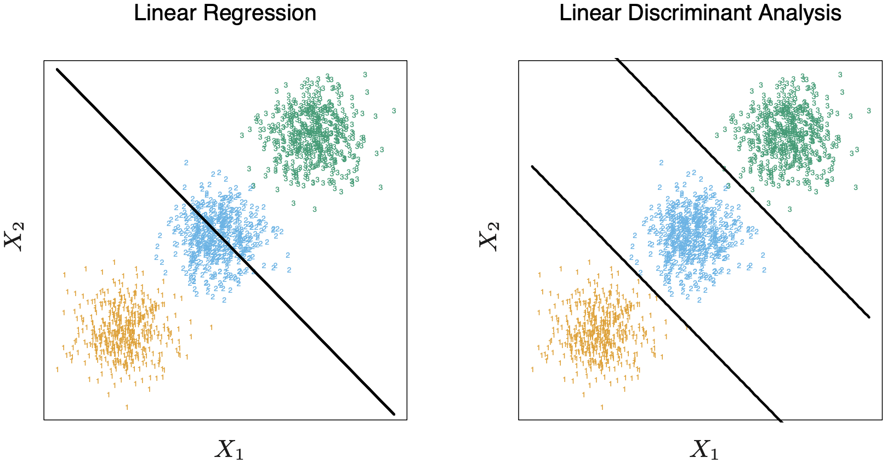
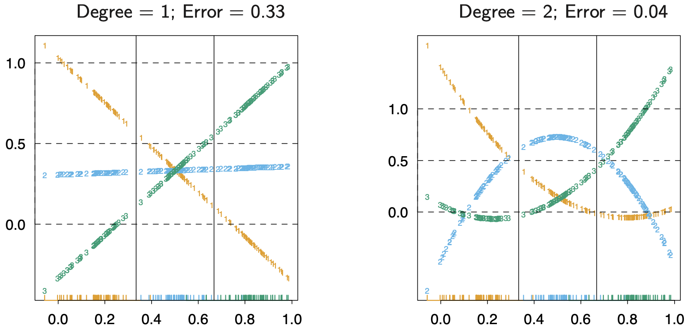

4.2 Linear Regression of an Indicator Matrix
=====================================

Suppose :math:`\mathcal{G}` has :math:`K` classes, each response category is associated with an indicator :math:`Y_k` with :math:`Y_k = 1` if :math:`G = k` else :math:`0`. These are collected together in a vector :math:`Y = (Y_1, \dots, Y_k)`, and the :math:`N` training instances of these form an :math:`N \times K` **indicator response matrix** :math:`\mathbf{Y}`. We fit a regression model to each of the columns of :math:`\mathbf{Y}` simultaneously, and the fit is given by

.. math::

   \hat{\mathbf{Y}} = \mathbf{X}(\mathbf{X}^\top \mathbf{X})^{-1}\mathbf{X}^\top\mathbf{Y}

From which we obtain the :math:`(p+1) \times K` coefficient matrix :math:`\hat{\mathbf{B}} = (\mathbf{X}^\top \mathbf{X})^{-1}\mathbf{X}^\top\mathbf{Y}`. A new observation with input :math:`x` is classified by first computing the fitted output :math:`\hat{f}(x)^\top = (1, x^\top)\hat{\mathbf{B}}` and then predicting the category by identifying the largest component: :math:`\hat{G}(x) = \text{argmax}_{k \in \mathcal{G}}\hat{f}_k(x)`.

One justification for this approach is to **view the regression as an estimate of conditional expectation**. For the random variable :math:`Y_k`, :math:`E(Y_k \mid X = x) = \Pr(G = k \mid X = x)`.

However, the issue is: how good an approximation to conditional expectation is the rather rigid linear regression model? Since we are using a linear regression, :math:`\hat{f}_k(x)` can be negative or larger than 1. (These violations do not guarantee that this approach will not work.)

A more realistic viewpoint is to construct targets :math:`t_k` for each class, where :math:`t_k` is the :math:`k`th column of the :math:`K \times K` identity matrix. Then we have :math:`y_i = t_k` if :math:`g_i = k`. We fit the linear model by least squares:

.. math::

   \min_\mathbf{B} \sum_{i=1}^N \lVert y_i - [(1, x_i^\top)\mathbf{B}]^\top \rVert^2

And a new observation is classified by:

.. math::

   \hat{G}(x) = \text{argmin}_k \lVert \hat{f}(x) - t_k \rVert^2

There is a serious problem with the regression approach when the number of classes :math:`K \geq 3`. The figure below shows an example where classes can be perfectly separated by linear decision boundaries, yet linear regression misses the middle class completely.

In the figure below the data is projected onto the line joining the three centroids, and the three response variables :math:`Y_1`, :math:`Y_2`, and :math:`Y_3` are coded. We see that the fitted values of class 2 are never dominant. This is referred to as the **effects of masking**.

For large :math:`K` and small :math:`p` such maskings naturally occur. In :math:`p`-dimensional input space, one would need general polynomial terms and cross-products of total degree :math:`K-1`, :math:`O(p^{K-1})` terms in all, to resolve such worst-case scenarios.

